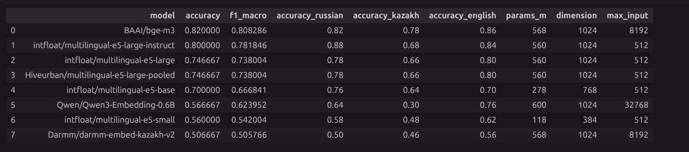
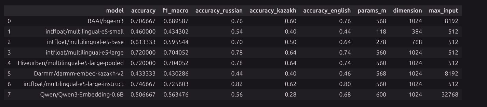
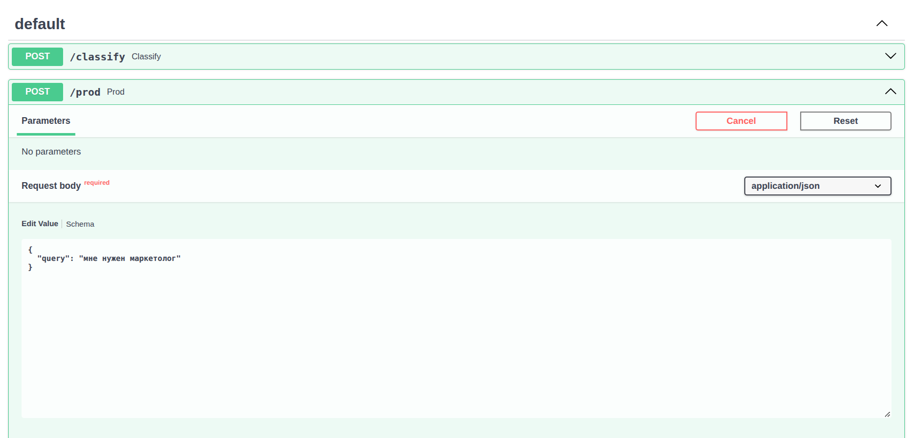
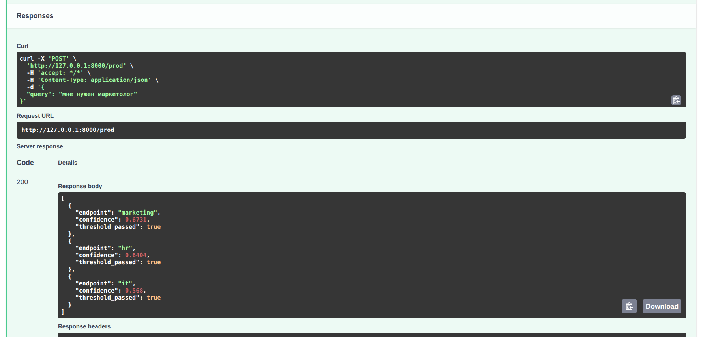

# Sota Classifier

Мультиязычный классификатор текстовых запросов на русском, казахском и английском языках. Проект сравнивает embedding-модели для определения намерения пользователя (`intent`) и предоставляет FastAPI-сервис на базе **BAAI/bge-m3**.

В основном сценарии запрос относится к одному из **50 действий**: управление будильниками, календарём, почтой, музыкой, умным домом и другими функциями. Отдельный небольшой набор `df_small` используется для проверки того же подхода на четырёх направлениях: `marketing`, `finance`, `hr`, `it`.

Исходное задание находится в [Task.md](Task.md), подготовка данных и сравнение моделей  в [model.ipynb](model.ipynb), самостоятельный сервис в [api.py](api.py).

## Как работает классификация

Модель используется без дообучения. Для каждого класса строится центр по размеченным примерам:

1. Фразы из обучающего набора преобразуются в нормализованные эмбеддинги.
2. Векторы одного класса усредняются; полученный центр снова нормализуется.
3. Входной запрос преобразуется в нормализованный вектор.
4. Скалярное произведение вектора запроса и центров даёт косинусное сходство.
5. Классы ранжируются по сходству.

```text
Размеченные фразы → BGE-M3 → усреднение по intent → центры классов
                                                       ↓
Запрос пользователя → BGE-M3 → косинусное сходство → top-3 кандидата
```

В `api.py` модель и центры обоих наборов загружаются в память один раз при старте процесса. На каждый запрос вычисляется только эмбеддинг нового текста и его сходство с центрами.


## Данные


| Файл в `datas/` | Фраз | Классов | Назначение |
| --- | ---: | ---: | --- |
| `df_train.jsonl` | 600 | 50 | Построение центров: 12 примеров на класс |
| `df_test.jsonl` | 150 | 50 | Основной тест: по одной фразе на RU, KK и EN для каждого класса |
| `df_test_error.jsonl` | 150 | 50 | Тест с опечатками и искажениями текста |
| `df_small.jsonl` | 60 | 4 | Полный небольшой набор: по 15 примеров на класс |
| `df_small_train.jsonl` | 48 | 4 | Построение центров для `/prod`: по 12 примеров на класс |
| `df_small_test.jsonl` | 12 | 4 | Проверка небольшого набора: по 3 примера на класс |

В репозитории также находятся исходные `train.jsonl`, `test.jsonl`, `devel.jsonl`. В начале ноутбука они объединяются, редкие классы фильтруются, затем выбирается по пять примеров для 75 классов. Этот подготовительный блок записывает `df_slurp.jsonl`; далее эксперименты используют отдельные готовые файлы `df_train.jsonl` и `df_test.jsonl` на 50 классов. Полный процесс создания этих мультиязычных файлов в ноутбуке не показан.

 Исходный датасет [датасет SLURP](https://github.com/pswietojanski/slurp/tree/master/dataset/slurp)

## Сравнение моделей

Ниже приведены результаты экспериментов, доступные в [results.csv](results.csv), [results_error.csv](results_error.csv) и ноутбуке. При подготовке документации эксперименты повторно не запускались.

В основном сравнении используется порог `THRESHOLD = 0.6`: если максимальное сходство ниже порога, предсказание заменяется на `unknown`. Считаются Accuracy, macro F1 по целевым классам и Accuracy отдельно для каждого языка. Язык определяется позицией строки в тестовом файле: повторяющийся порядок **русский → казахский → английский**. При изменении порядка строк языковые метрики нужно пересмотреть.

### Основной тест

BGE-M3, используемая в API, показывает лучший общий результат и лучшую точность на казахском в этом эксперименте.



### Тест с опечатками

Для BGE-M3 опечатки снижают общую Accuracy с 82.00% до 70.67%, а Accuracy на казахском — с 78% до 60%. На этом наборе лидирует E5-large-instruct.




## Запуск FastAPI
При первом запуске веса`BAAI/bge-m3` загружаются через `SentenceTransformer`.

```bash
python3 -m venv .venv
source .venv/bin/activate
python -m pip install sentence-transformers numpy pandas fastapi uvicorn
python api.py
```

### Методы API

| Метод | Путь | Классы | Источник центров |
| --- | --- | --- | --- |
| POST | `/classify` | 50 действий | `datas/df_train.jsonl` |
| POST | `/prod` | `marketing`, `finance`, `hr`, `it` | `datas/df_small_train.jsonl` |

Оба метода принимают объект с обязательным строковым полем `query` длиной не менее одного символа и возвращают массив из трёх кандидатов, отсортированных по убыванию сходства.


В `api.py` для обоих методов установлен **порог 0.40**. Каждый кандидат содержит:

- `endpoint` — название класса;
- `confidence` — сходство, округлённое до четырёх знаков после запятой;
- `threshold_passed` — достигло ли сходство порога; проверка выполняется до округления.


### Проверка текущего пайплайна на `df_small`






Скриншоты демонстрируют отдельный запрос. Итоговая Accuracy на `df_small_test` в сохранённом выводе соответствующей ячейки ноутбука отсутствует.

## Скорость работы


| Метод | Время обработки |
| --- | --- |
| `/classify` | 0.815 с (815 мс) |
| `/prod` | 0.167–0.185 с (167–185 мс) |
